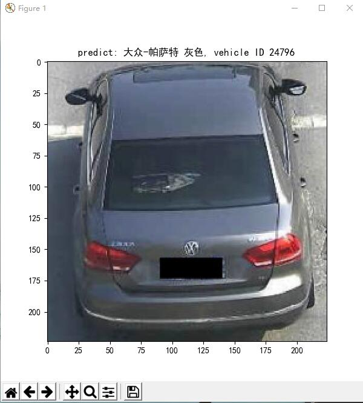
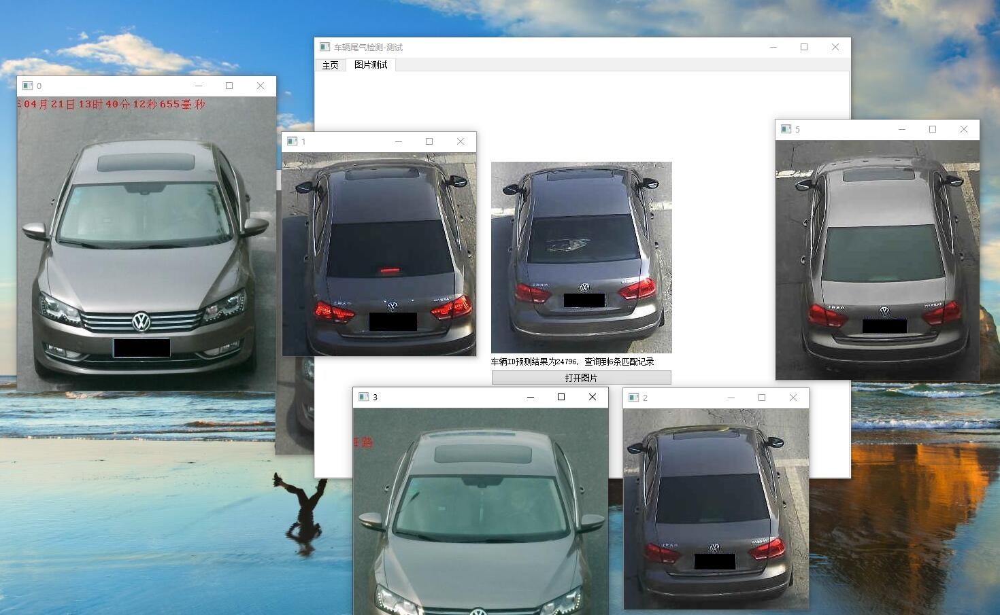

# 车辆检测与检索系统--检索部分
本项目是车辆检索与检测系统的检索部分，通过读取图片，分析得到车辆ID，并从数据库中检索到相匹配的车辆。
不过目前依然存在一些需要改进的地方，之后再提交更新的版本。

## 小组成员
西安交通大学软件学院场景检索与检测组
吴潇、宋康、刘敬乐、宋晨明

## 代码结构
```
>imgs 测试图片，一些车辆的图像
>ui_imgs 图形化界面图像
>waiting2mark 等待标记的代码文件
......
>db_opt.py 数据库操作，用于向数据库查询匹配车辆
>InitRepNet.py 网络结构初始化
>RepNet.py 网络结构以及一些工具类
>RepNetV1.py 修改的第一个版本的代码
>RepNetV2.py 修改的第二个版本的代码，命令行运行，需要给定图片路径， 主体代码从2013行开始， 有相关注释
>RepNetV3.py 修改的第三个版本的代码，直接运行，图形化界面操作, 主体代码从2021行开始，有相关注释
>ui_widget.py ui界面设计，使用pyqt5
```
## 如何运行
首先请安装anaconda，为了提高下载速度，请将源更换为国内的源
### 环境安装
```
conda create -n vehicle python=3.6
```
请确保你的电脑已经安装cuda，通过nvcc -V可以查看cuda版本

### 代码下载
```
> conda activate vehicle
> git clone
> cd vehicle_search_xjtu
> pip install -r requirements.txt
```
### 下载数据集和预训练的模型
抱歉，暂时不能提供预训练的模型以及代码，如果需要，请联系我
1148392984@qq.com

### 程序运行
主要运行程序为RepNetV2.py以及RepNetV3.py
 ```
python RepNetV2.py -i <vehicle_image>
```
OR
```
python RepNetV3.py
```
## 改进地方
* 图形化界面，部分地方改成线程调用
* 代码封装，要将一部分代码封装成类
* 数据库改进，为了提高查询速度，后期修改为mongodb数据库
* 添加训练模块代码

## 运行截图





## 参考
[RepNet-MDNet-VehicleReID](https://github.com/CaptainEven/RepNet-MDNet-VehicleReID)
[Deep Relative Distance Learning: Tell the Difference Between Similar Vehicles](https://github.com/CaptainEven/RepNet-MDNet-VehicleReID)


## License
[MIT](https://doge.mit-license.org/)


